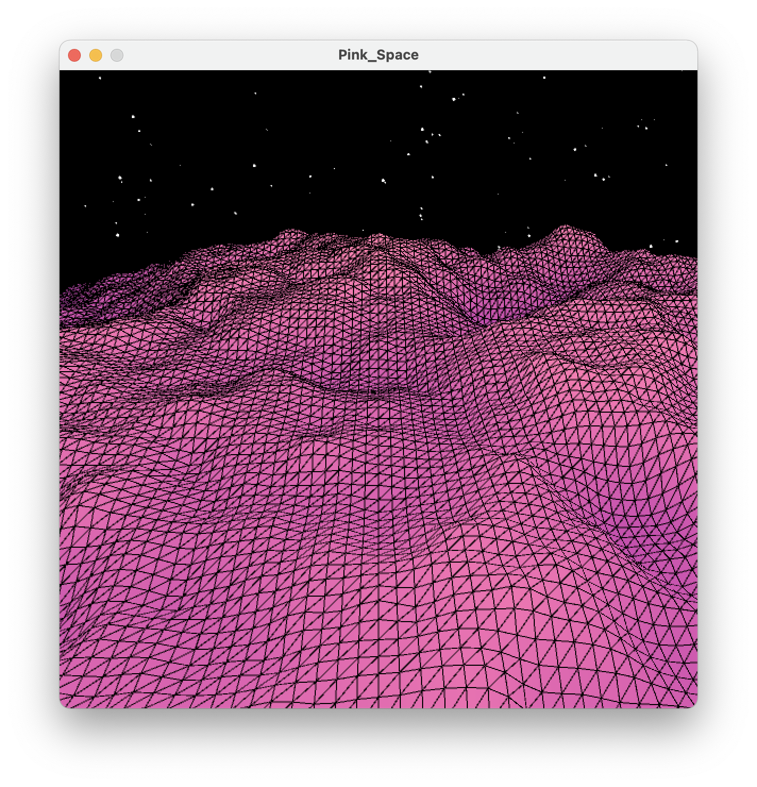
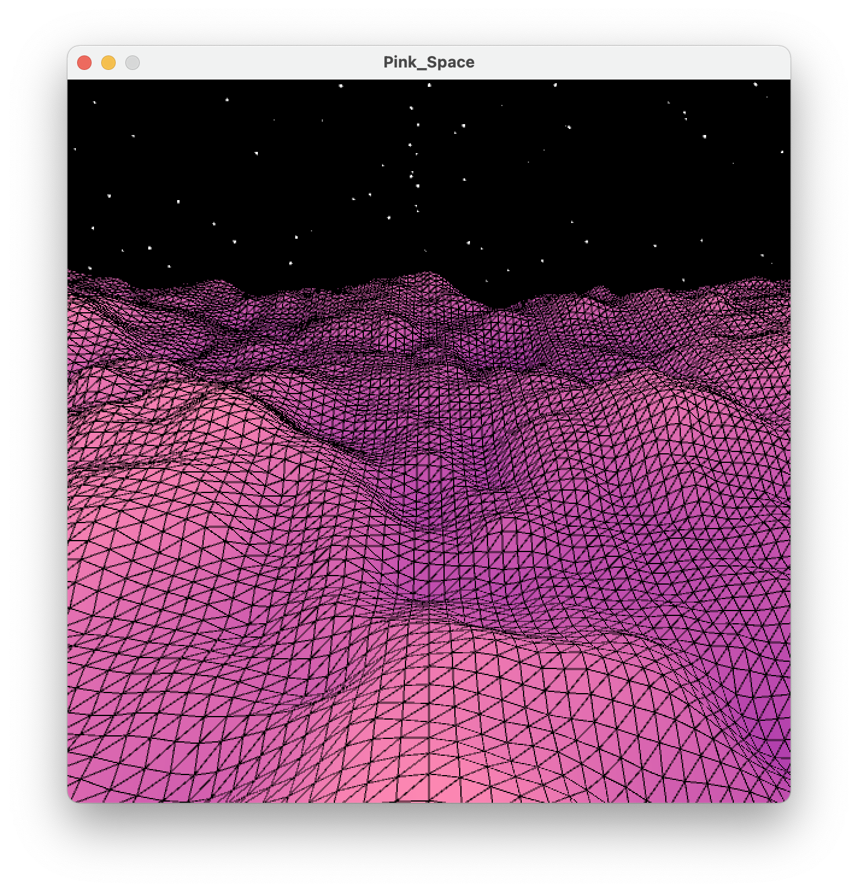
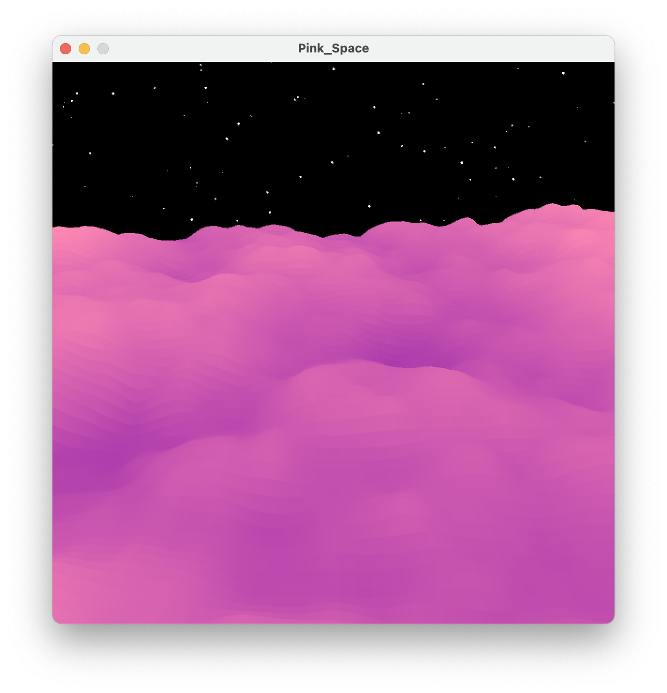
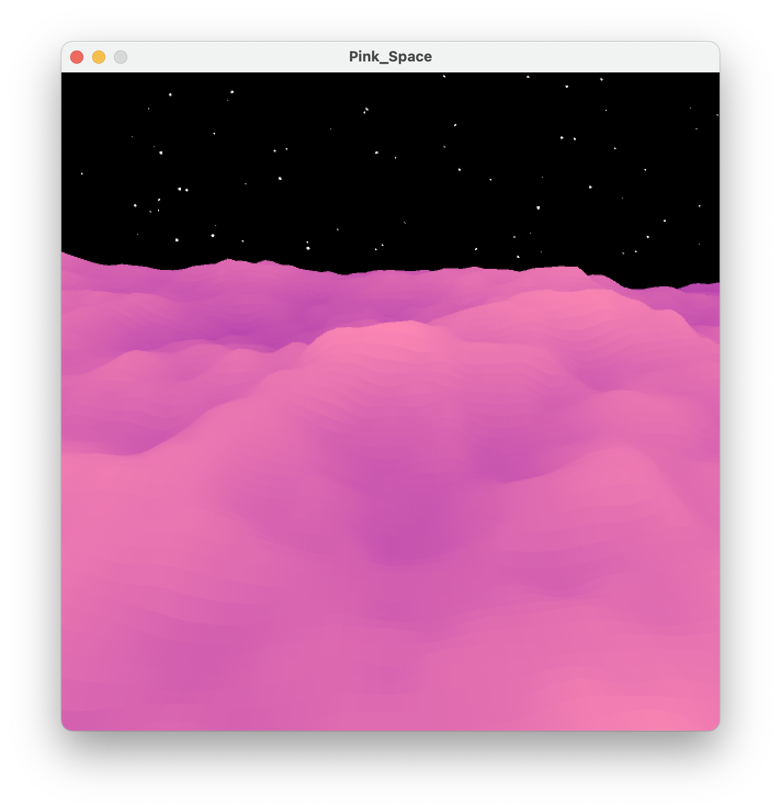

# Pink-Space

This small project uses Perlin noise to create a planet's surface in space with stars beyond the horizon.

Using or not using `noStroke()` will dethermine whether you end up with a soft, cloud like surface or a futuristic Tron-like surface. Below are images of both.

<h3 align = 'center'>With Stroke</h3>

  
  

<h3 align = 'center'>Without Stroke</h3>

  
  

